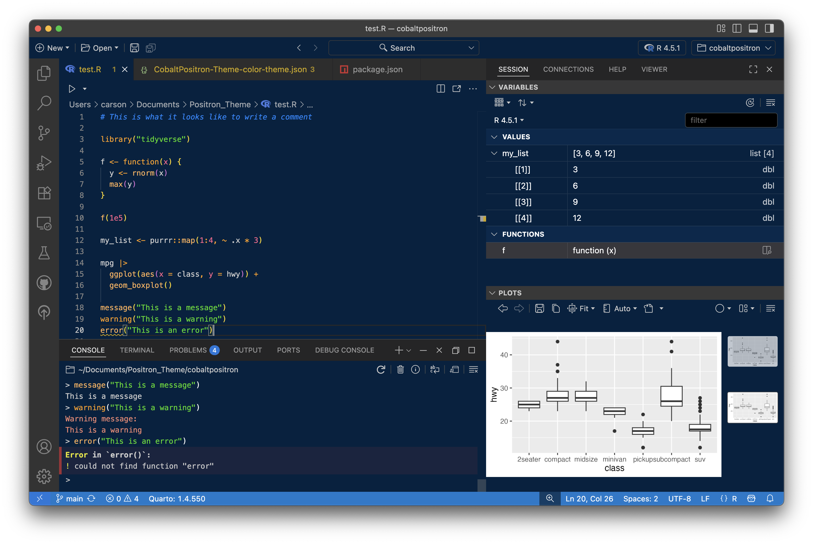

# CobaltPositron Theme

A modern, dark cobalt-inspired theme designed for **Positron** and **Visual Studio Code**.  
This theme brings deep blues, sharp contrast, and a developer-friendly aesthetic to your coding environment.

## Installation

Once the theme is published to the **VSX Marketplace**, you can install it directly:

1. Open **Positron** (or **VS Code**).
2. Go to the **Extensions** view:
   - Click the Extensions icon in the Activity Bar on the side of the window.
   - Or press:
     - `Ctrl+Shift+X` (Windows/Linux)  
     - `Cmd+Shift+X` (macOS)
3. Search for **CobaltPositron-Theme**.
4. Click **Install**.

## Activation

After installing:

1. Open the **Command Palette**:
   - `Ctrl+Shift+P` (Windows/Linux)  
   - `Cmd+Shift+P` (macOS)
2. Type `Color Theme` and select **Preferences: Color Theme**.
3. From the list, choose **CobaltPositron-Theme**.

Here are the `settings.json` the author of this theme is running at the time of publication:

```
{
    "window.autoDetectColorScheme": true,
    "workbench.preferredDarkColorTheme": "CobaltPositron-Theme",
    "files.associations": {
        "renv.lock": "json"
    },
    "workbench.iconTheme": "ayu",
    "workbench.settings.editor": "json",
    "editor.formatOnSave": true,
    "editor.fontFamily": "'JetBrains Mono', monospace",
    "editor.fontSize": 13,
    "editor.fontWeight": "normal",
    "editor.fontLigatures": true,
    "editor.parameterHints.enabled": false
}
```

## Features

- Dark cobalt base with balanced contrast for readability.  
- Carefully chosen accent colors for syntax highlighting.  
- Optimized for both long coding sessions and presentations.  




## Contributing

If you have suggestions or find issues, please open an issue or pull request on the [GitHub repository](https://github.com/carsonslater/cobaltpositron).


## License

This theme is released under the [MIT License](LICENSE).  


**Enjoy coding with CobaltPositron!**

