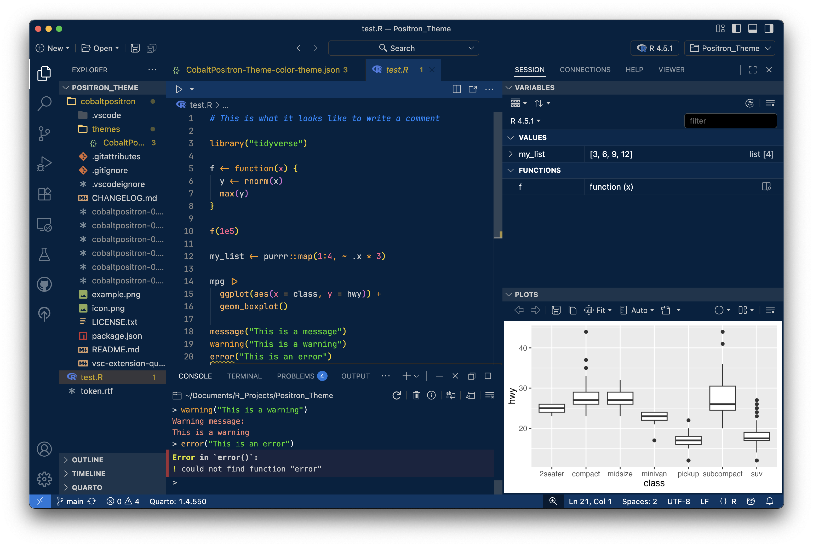

# CobaltPositron Theme

A modern, dark cobalt-inspired theme designed for **Positron** and **Visual Studio Code**.
This theme brings deep blues, sharp contrast, and a developer-friendly aesthetic to your coding environment.

## Installation

Once the theme is published to the **VSX Marketplace**, you can install it directly:

1. Open **Positron** (or **VS Code**).
2. Go to the **Extensions** view:
   - Click the Extensions icon in the Activity Bar on the side of the window.
   - Or press:
     - `Ctrl+Shift+X` (Windows/Linux)
     - `Cmd+Shift+X` (macOS)
3. Search for **CobaltPositron-Theme**.
4. Click **Install**.

## Activation

After installing:

1. Open the **Command Palette**:
   - `Ctrl+Shift+P` (Windows/Linux)
   - `Cmd+Shift+P` (macOS)
2. Type `Color Theme` and select **Preferences: Color Theme**.
3. From the list, choose **CobaltPositron-Theme**.

Here are the `settings.json` the author of this theme is running at the time of publication:

```
{
    "window.autoDetectColorScheme": true,
    "workbench.preferredDarkColorTheme": "CobaltPositron-Theme",
    // color theme settings
    "workbench.colorCustomizations": {
        "[CobaltPositron-Theme]": {
            "tab.inactiveBackground": "#002240",
            "tab.inactiveForeground": "#ffffff",
            "tab.activeBackground": "#013664",
            "tab.activeForeground": "#002240",
            "editorGroupHeader.tabsBackground": "#002240",
            "activityBar.background": "#002240",
            "statusBar.background": "#013664",
            "sideBar.background": "#002240",
            "titleBar.activeBackground": "#002240"
        }
    },
    "files.associations": {
        "renv.lock": "json"
    },
    //vertical line to keep code vertical
    "editor.rulers": [
        80
    ],
    // handle newline saving adapted from
    // https://rfdonnelly.github.io/posts/sane-vscode-whitespace-settings/
    "files.insertFinalNewline": true,
    "editor.renderFinalNewline": "dimmed",
    "files.trimFinalNewlines": true,
    "files.trimTrailingWhitespace": true,
    // also render trailing whitespace, since it'll get trimmed
    "editor.renderWhitespace": "trailing",
    // pretty cursor
    "editor.cursorBlinking": "phase",
    "editor.cursorStyle": "line",
    // otherwise opening two files closes the first ???
    "workbench.editor.enablePreview": false,
    // adds more lines to the file tab
    "workbench.tree.renderIndentGuides": "always",
    // prettier folders since vscode is ugly by default
    "workbench.iconTheme": "ayu",
    "workbench.settings.editor": "json",
    // use air
    "editor.formatOnSave": true,
    // better pasting
    "editor.formatOnPaste": true,
    // font and what not
    "editor.fontFamily": "'JetBrains Mono', monospace",
    "editor.fontSize": 13,
    "editor.fontWeight": "normal",
    "editor.fontLigatures": true,
    "editor.parameterHints.enabled": false,
    // adds lines for the current bracket you're in
    "editor.guides.bracketPairs": "active",
    "workbench.startupEditor": "none",
    // gotta keep my RStudio keybindings
    "workbench.keybindings.rstudioKeybindings": true,
    // enable assistant
    "positron.assistant.consoleActions.enable": false // for now
}
```
These settings are derived from [Christopher Kenny's blog post](https://christophertkenny.com/posts/2024-06-29-positron-settings/).

## Features

- Dark cobalt base with balanced contrast for readability.
- Carefully chosen accent colors for syntax highlighting.
- Optimized for both long coding sessions and presentations.



Note this example reflects the custom tweaks I made in my `settings.json` file.

## Contributing

If you have suggestions or find issues, please open an issue or pull request on the [GitHub repository](https://github.com/carsonslater/cobaltpositron).


## License

This theme is released under the [MIT License](LICENSE.txt).


**Enjoy coding with CobaltPositron!**
